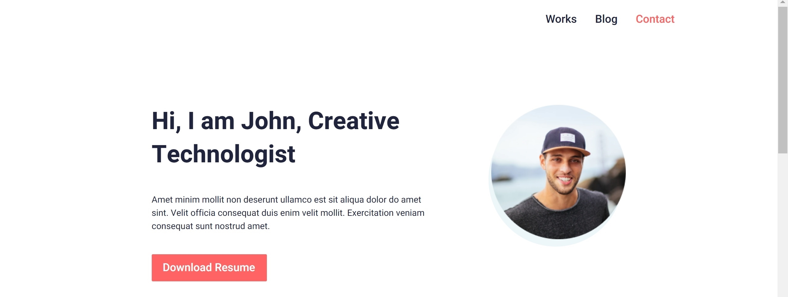

# John

> ___John___ - adaptive site that I made for practice

[view in browser]( https://annazakavova.github.io/John/)

```
language -english
``` 

* __created whith__
	* HTML
	* SCSS
	* JS

* __Acknowledgments__
	YouTube channel ["Фрилансер по жизни - IT и фриланс"](https://www.youtube.com/watch?v=vkq7ckCkvjY&t=8593s), for loyout in [Figma](https://www.figma.com/file/f9KW32gy9LLhEnxsuztdQC/John?node-id=0%3A1)

```
some photos
``` 


